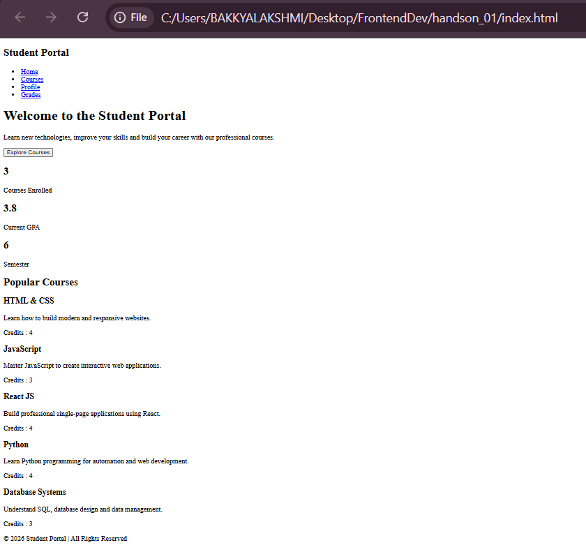

# Hands-On 1 – HTML5 Fundamentals

## Objective

Learn the fundamentals of HTML5 by creating a basic Student Portal webpage using semantic HTML elements.

## Topics Covered

- HTML5 Structure
- Semantic Elements
- Headings
- Paragraphs
- Lists
- Links
- Images
- Tables
- Forms

## Features

- Student Portal Homepage
- Navigation Menu
- Student Information
- Course Details
- Contact Form
- Semantic HTML Layout

## Technologies Used

- HTML5

## Project Structure

```
handson_01/
├── index.html
└── README.md
```

## How to Run

Open `index.html` in any modern web browser.

## Output:


## Learning Outcome

Built a structured webpage using semantic HTML5 elements and understood the basics of web page development.