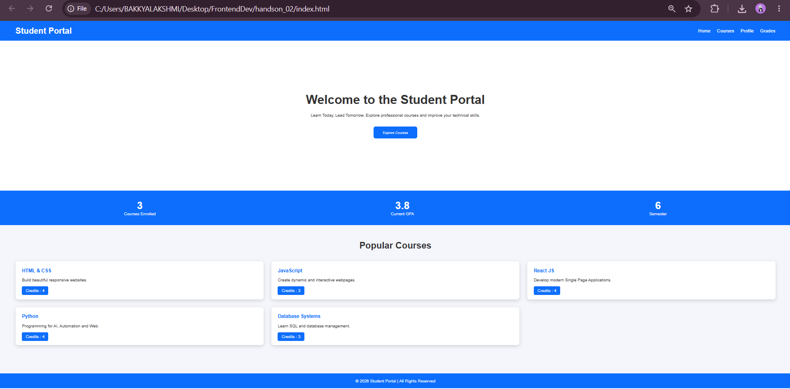

# Hands-On 2 – CSS3 Styling & Layout

## Objective

Apply CSS3 to improve the appearance and layout of the Student Portal.

## Topics Covered

- CSS Selectors
- Colors
- Fonts
- Margin & Padding
- Flexbox
- Box Model

## Features

- Responsive Navigation Bar
- Styled Cards
- Buttons
- Layout using Flexbox
- Footer

## Technologies Used

- HTML5
- CSS3

## Project Structure

```
handson_02/
├── index.html
├── style.css
└── README.md
```

## How to Run

Open `index.html` in your browser.

## Output


## Learning Outcome

Designed an attractive and responsive webpage using CSS3.