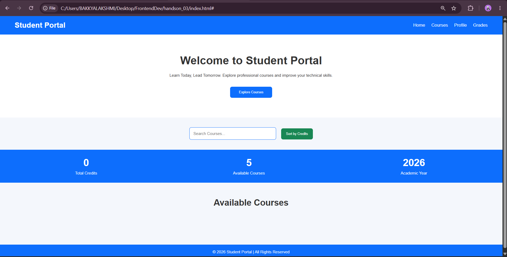

# Hands-On 3 – JavaScript Basics

## Objective

Add interactivity to the Student Portal using JavaScript.

## Topics Covered

- Variables
- Functions
- DOM Manipulation
- Events
- Conditions
- Loops

## Features

- Button Click Events
- Dynamic Content
- Form Validation
- User Interaction

## Technologies Used

- HTML5
- CSS3
- JavaScript

## Project Structure

```
handson_03/
├── index.html
├── style.css
├── script.js
└── README.md
```

## How to Run

Open `index.html` in any browser.

## Output


## Learning Outcome

Implemented dynamic webpage behavior using JavaScript.