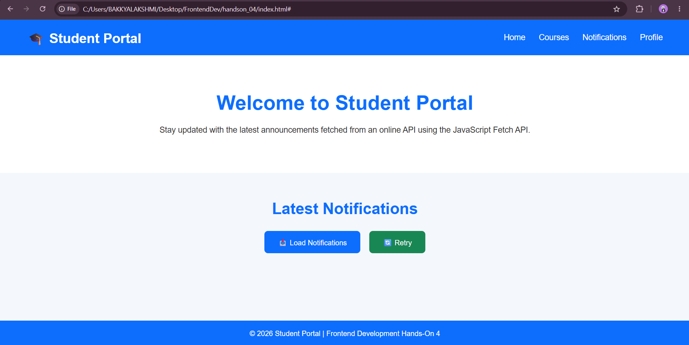
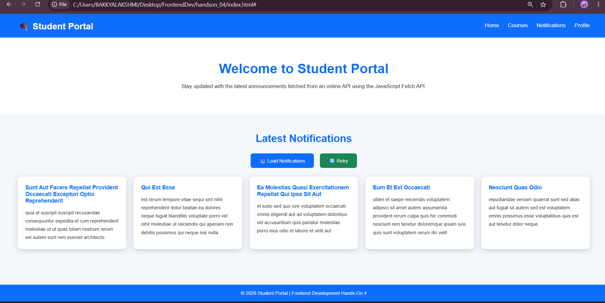

# Hands-On 4 – React Components

## Objective

Learn React fundamentals by creating reusable UI components.

## Topics Covered

- JSX
- Components
- Props
- State
- Event Handling

## Features

- Header Component
- Footer Component
- Student Cards
- Reusable Components

## Technologies Used

- React
- JavaScript
- CSS

## How to Run

```bash
npm install
npm start
```

## Output


## Learning Outcome

Developed reusable React components following component-based architecture.