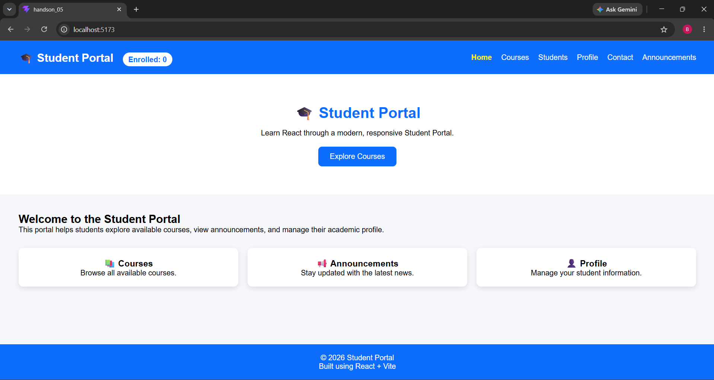
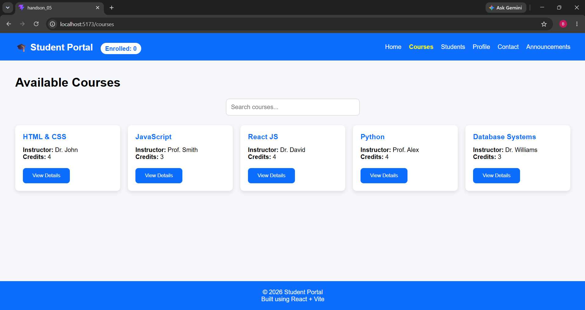
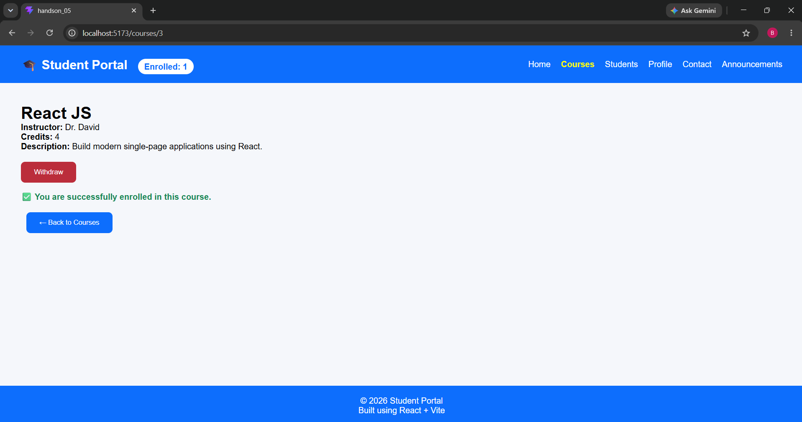
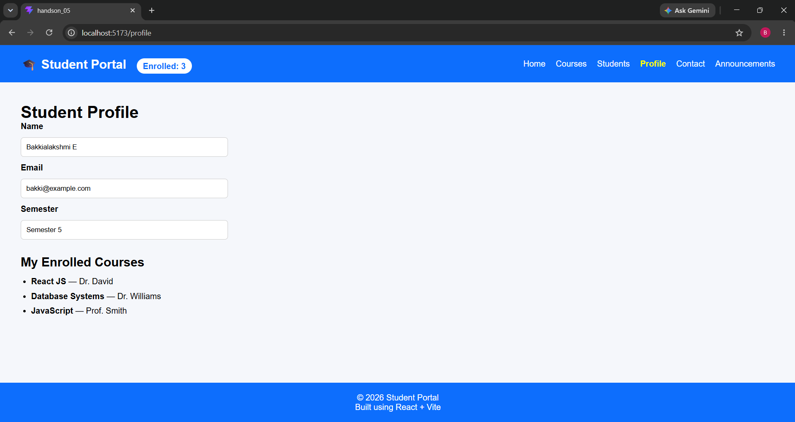
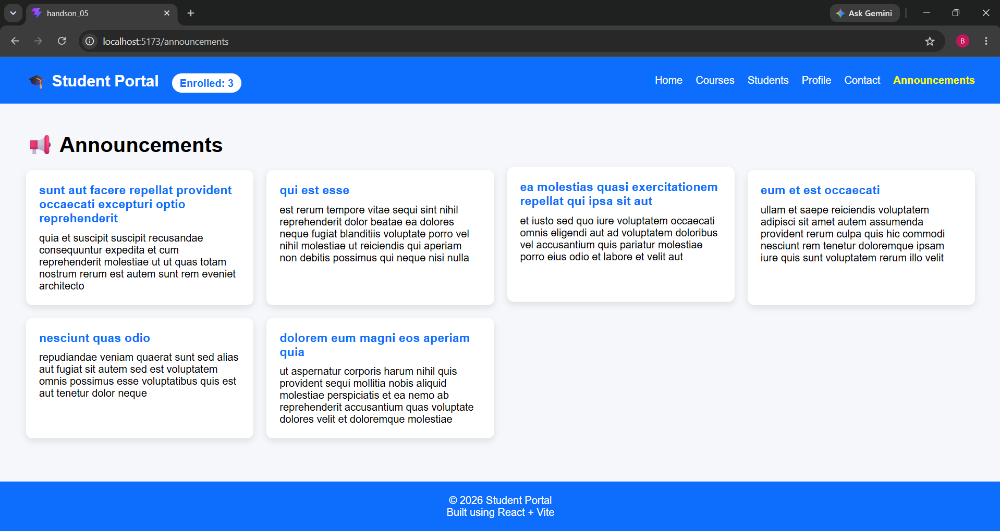

# Hands-On 5 & 6 – React Routing, Forms & API Integration

## Objective

Develop a React-based Student Portal by implementing routing, forms, API integration, and reusable components.

## Topics Covered

- React Components
- React Router
- Props & State
- Event Handling
- Forms & Validation
- Axios / Fetch API
- REST API Integration
- Loading State
- Error Handling

## Features

- Home Page
- Courses Page
- Student Profile
- Contact Page
- Navigation Bar
- Registration Form
- Form Validation
- API Data Fetching
- Dynamic Content Rendering
- Loading Indicator

## Technologies Used

- React
- React Router
- JavaScript (ES6+)
- HTML5
- CSS3
- Axios / Fetch API

## API Used

https://jsonplaceholder.typicode.com/users

## Project Structure

```
src/
├── components/
├── pages/
├── services/
├── App.js
└── index.js
```

## How to Run

```bash
npm install
npm start
```
## Output






## Learning Outcome

Successfully developed a React application using routing, reusable components, form validation, and REST API integration following modern React development practices.