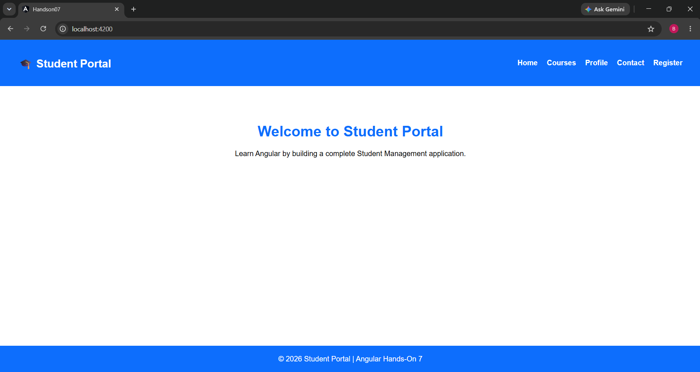
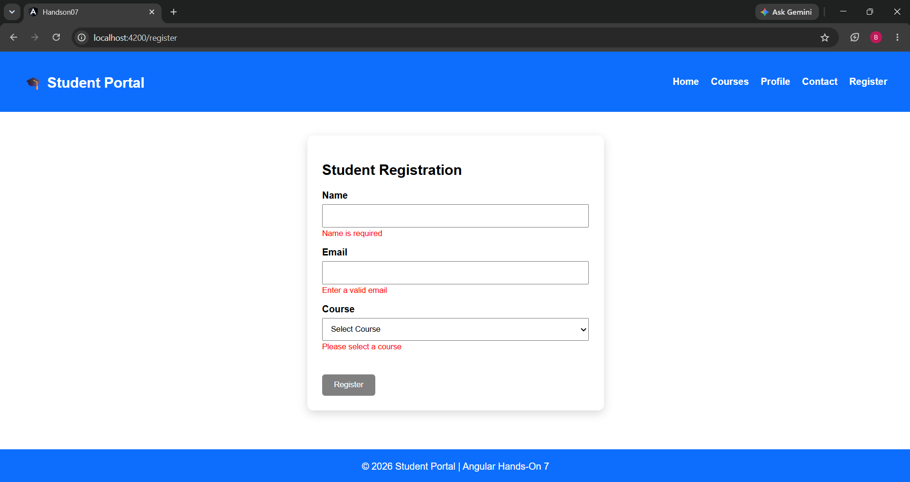
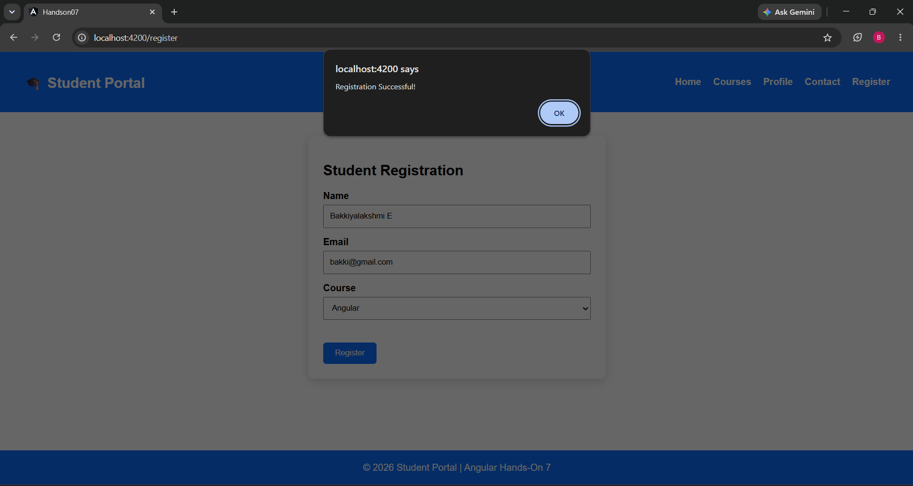

# Hands-On 7 – Angular Components, Services, DI, Routing & Forms

## Objective

This project demonstrates the fundamentals of Angular by building a Student Portal application using components, services, dependency injection, routing, HTTP client, and reactive forms. :contentReference[oaicite:0]{index=0}

## Topics Covered

- Angular CLI
- Components & Modules
- Services
- Dependency Injection
- Angular Router
- Reactive Forms
- HttpClient
- RxJS

## Features

- Header and Footer components
- Home page
- Courses page
- Course Details page
- Student Profile page
- Contact page
- Registration Form
- Routing using Angular Router
- Course Service
- HTTP Client integration
- Loading Spinner
- Form Validation

## Technologies Used

- Angular 16
- TypeScript
- HTML5
- CSS3
- RxJS
- Angular Router
- Reactive Forms
- HttpClient

## Project Structure

```
src/
 ├── app/
 │   ├── header/
 │   ├── footer/
 │   ├── home/
 │   ├── courses/
 │   ├── course-card/
 │   ├── course-details/
 │   ├── profile/
 │   ├── registration/
 │   ├── services/
 │   ├── models/
 │   └── app-routing.module.ts
```

## How to Run

```bash
npm install
ng serve
```

Navigate to:

```
http://localhost:4200
```
## Output



## Learning Outcome

Successfully implemented Angular components, routing, dependency injection, HTTP services, and reactive forms to build a Student Portal application.