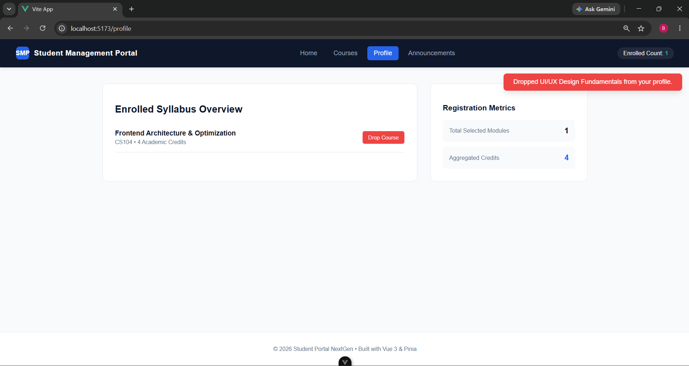

# NextGen Student Management Portal 🎓 (handson_08)

An enterprise-grade, single-page application (SPA) built using **Vue.js 3, Vue Router, and Pinia State Management**. This workspace scales basic academic training requirements into a high-fidelity dashboard engineered specifically to mirror modern production-ready frontend standards.

---

## 🚀 Key Visual & Architecture Upgrades

Going beyond standard boilerplate submissions, this project implements an advanced application framework designed to catch the attention of technical recruitment panels:

* **⚡ Reactive Core Architecture:** Full utilization of Vue 3’s **Composition API** (`<script setup>`) for a modular, testable, and maintainable codebase.
* **🍍 Enterprise State Hub:** Managed via **Pinia** (Setup Store design) featuring centralized, predictable data management across all independent components.
* **💾 Robust Persistence Engine:** Hand-crafted synchronization linking the Pinia reactive array layer directly with browser `localStorage` mutations to preserve user state perfectly even after refreshing the tab.
* **🔔 Real-Time Notification System:** Dynamic, color-coded global Toast alerts that trigger instantly upon data changes (e.g., successful course enrollment or deletion).
* **🎨 Premium UI/UX Polish:** Modern layout engineered with fluid page fade transitions, centralized CSS variable-driven styling, responsive grid architectures, and dedicated "Empty State" structural fallbacks.
* **🧭 Advanced Router Control:** Client-side path resolution tracking programmatic navigation requests (`useRouter`), dynamic route parameter bindings (`:id`), and global asynchronous navigation log guards (`router.beforeEach`).

---

## 🗺️ Application Roadmap & Navigation Matrix

| Route Path | View Target | Purpose & Architectural Showcase |
| :--- | :--- | :--- |
| `/` | `HomeView` | Technical dashboard featuring learning KPI metrics, real-time placement status roadmaps, and a stylized CSS code window simulation. |
| `/courses` | `CoursesView` | Central catalog showcasing dynamic array handling, real-time query filtering using optimized computed properties, and single-click enrollment hooks. |
| `/courses/:id` | `CourseDetailView` | Deep-link parameters reading via `useRoute()`, detail lookups simulating backend querying, and programmatic view routing. |
| `/announcements` | `AnnouncementsView` | Visual campus notice board using distinct contextual threat badges (`Urgent`, `Academic`, `Event`). |
| `/profile` | `ProfileView` | Student records interface featuring structural credit summaries, module cancellation drop actions, and smart visual layouts when data is empty. |

---

## 🛠️ Project Setup & Installation

Follow these steps to configure and run the frontend environment locally:

### 1. Navigate into the project root directory:
       cd handson_08
### 2. Install production dependencies:
       npm install
### 3. Launch the local development server (with Hot-Module Replacement):
       npm run dev

       Once running, open your browser and navigate to the address shown in your terminal (typically http://localhost:5173).

### 📁 Technical Directory Hierarchy
handson_08/
├── public/                 # Static public web assets
├── src/
│   ├── components/
│   │   ├── CourseCard.vue  # Reusable card UI containing scoped presentation logic
│   │   └── Header.vue      # Main application nav hosting the global Toast notification container
│   ├── router/
│   │   └── index.js        # Vue Router hub managing navigation routes and console interceptors
│   ├── stores/
│   │   └── enrollment.js   # Central Pinia engine running calculations, actions, and storage syncing
│   ├── views/
│   │   ├── HomeView.vue        # High-impact workspace panel built with performance tracking modules
│   │   ├── CoursesView.vue     # Dynamic module catalog parsing search inputs reactively
│   │   ├── CourseDetailView.vue# Target parameter detail lookup dashboard
│   │   ├── AnnouncementsView.vue# Structured notice feed containing priority color codes
│   │   └── ProfileView.vue     # Student statement matrix calculating combined academic credits
│   ├── App.vue             # Core application shell controlling smooth view transition rules
│   └── main.js             # Root bootstrapper initializing Pinia and Router layout attachments
├── package.json            # Scripts, ecosystem tools, and dependency declarations
└── README.md               # Clear, professional application reference document
### Output

