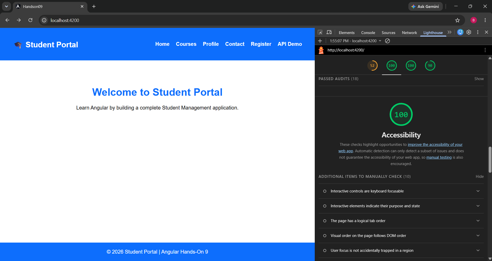

# Hands-On 9 – Accessibility & Cross Browser Compatibility

## Objective

Improve the Student Portal by implementing accessibility best practices and performing browser compatibility testing. :contentReference[oaicite:2]{index=2}

## Topics Covered

- WCAG 2.1
- Semantic HTML
- ARIA Attributes
- Keyboard Navigation
- Lighthouse Audit
- Cross Browser Compatibility

## Features

- Semantic Navigation
- ARIA Labels
- Keyboard Accessible Components
- Accessible Forms
- Loading Announcements
- Lighthouse Improvements

## Lighthouse Results

| Metric | Score |
|---------|------:|
| Accessibility | 100 |
| Best Practices | 100 |
| SEO | 90 |

## Technologies

- Angular 16
- HTML5
- CSS3
- Lighthouse
- Chrome DevTools

## Run

```bash
npm install
ng serve
```
## Output

## Learning Outcome

Enhanced the Student Portal following WCAG accessibility standards and improved usability across browsers.