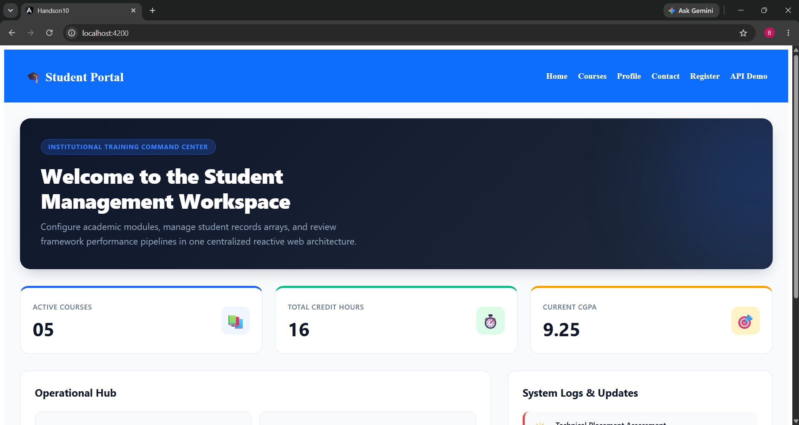
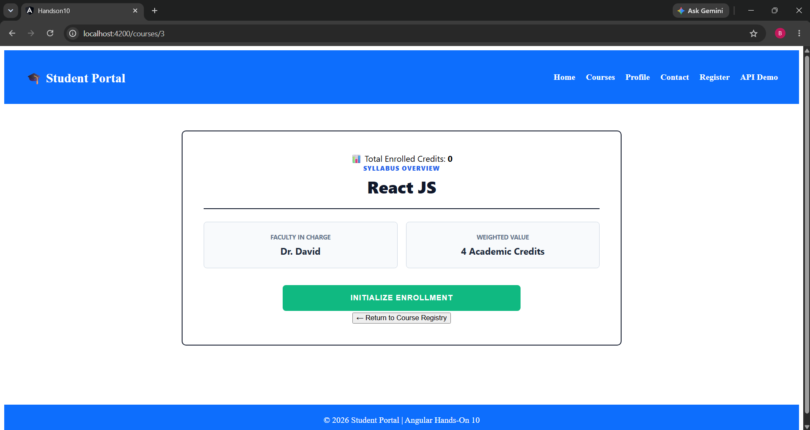
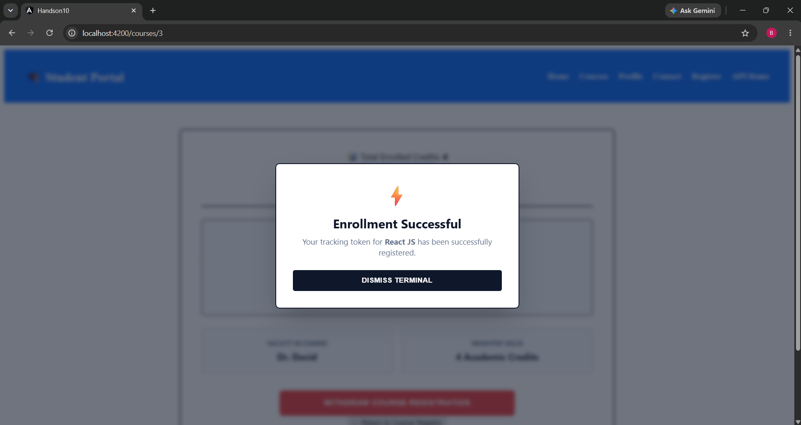
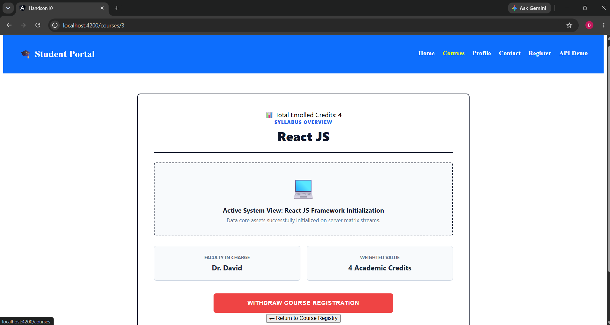
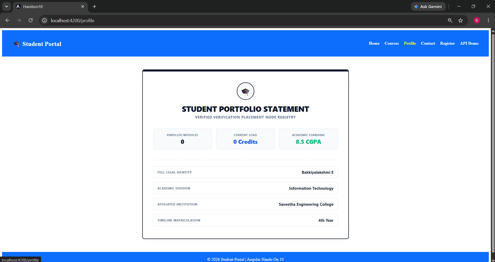
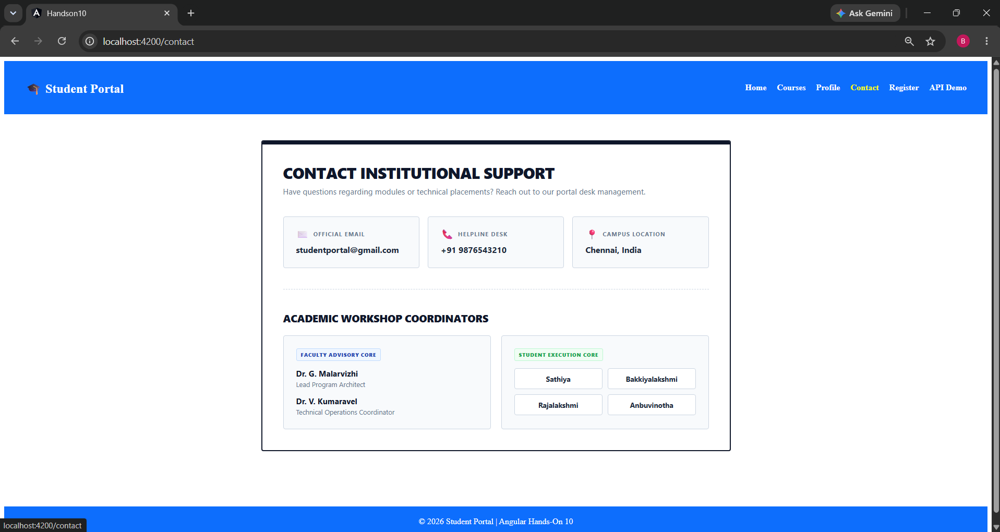
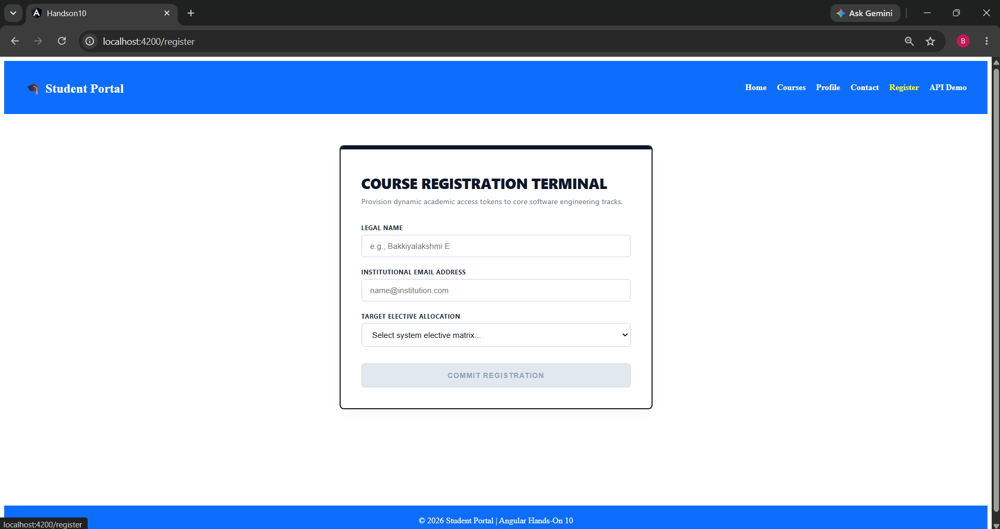
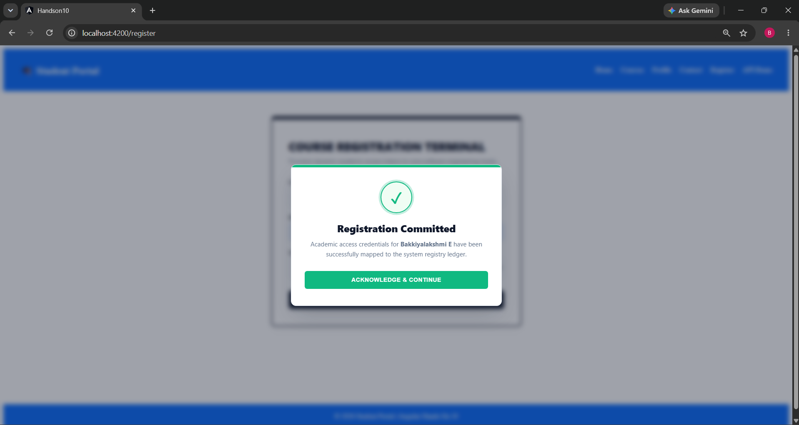
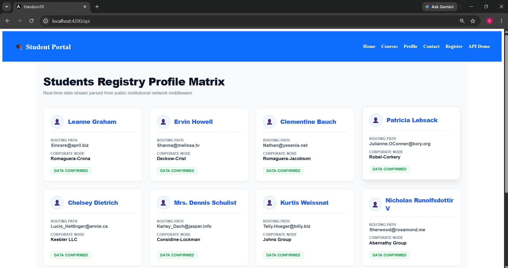
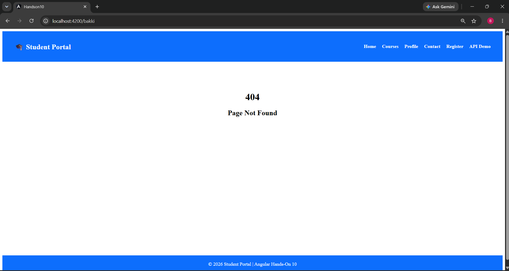

# Hands-On 10: API Integration & Advanced State Management

## Objective
This hands-on demonstrates API integration using a centralized API layer and advanced state management concepts in Angular with NgRx.

## Technologies Used
- Angular 16
- TypeScript
- Axios
- NgRx Store
- NgRx Effects
- RxJS

## Features Implemented
- Centralized API Layer
- Axios Request & Response Interceptors
- NgRx State Management
- Actions
- Reducers
- Effects
- Selectors
- Global Error Handler
- API Integration using JSONPlaceholder

## State Management Comparison

| Feature | React + Redux | Angular + NgRx | Vue + Pinia |
|---------|---------------|----------------|-------------|
| Learning Curve | Medium | High | Easy |
| Boilerplate | Moderate | High | Low |
| State Management | Redux Toolkit | NgRx | Pinia |
| Side Effects | Redux Thunk / Redux Toolkit | Effects | Actions |
| Tooling | Redux DevTools | NgRx DevTools | Vue DevTools |
| Integration | External Library | Angular Ecosystem | Vue Ecosystem |

## 📂 Project Architecture

The workspace follows a strict structural component-driven layout designed for maximum performance, clean code separation, and separation of concerns:

```text
src/app/
├── course-list/          # Sub-module course presentation triggers
├── courses/              # Core course registry grid card matrix layout
├── course-details/       # Dynamic workspace views with context-aware triggers
├── registration/         # Form processing node terminal with custom reactive validation
├── profile/              # Executive portfolio dashboard showing real-time metrics
├── contact/              # Institutional support center & event coordinator matrix
├── home/                 # Application gateway landing shell view
├── loading-spinner/      # Pure CSS keyframe loading animation framework
├── not-found/            # Routing boundary safeguard page
├── services/             # Core network data interceptors
├── models/               # Explicit TypeScript parameter data interfaces
├── store/                # Scalable global NGRX state management pipelines
│   ├── actions/
│   ├── effects/
│   ├── reducers/
│   └── selectors/
├── enrollment.service.ts # Shared operational state machine tracker
├── app-routing.module.ts # Core application route navigation tree
└── app.module.ts         # Main system registration bundle module
```

## Output 
homepage-image

coursepage-image




profilepage-image

cantactpage-image

registrationpage-image


apiDemopage-image

notfound-image


## Conclusion

- React + Redux is flexible and widely used.
- Angular + NgRx provides a structured architecture suitable for large enterprise applications.
- Vue + Pinia offers a lightweight and easy-to-learn state management solution with minimal boilerplate.